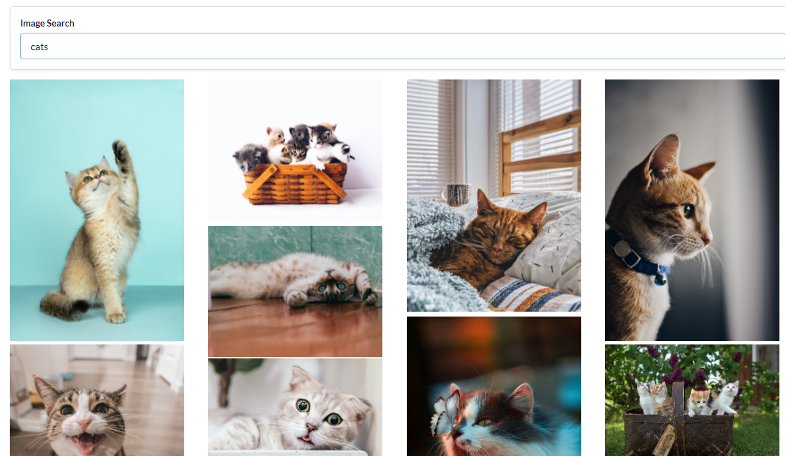

# Image Search React App using Unsplash API 

In This practice project, we have implemented a search bar using Semantic UI. In the SearchBar Component, when user types anything in the input field onChange attribute reads the value and in the onSubmit attribute of the form a callback function was passed. This callback funtion has to be arrow funtion to bind the value of this. The SearchBar is a child component and it's parent component is App component. With the prop system we can only communicate from a parent component to a child component. In this case, we wanted to pass our search term from a child component to the parent component. So, in order to communicate from a child to a parent we passed a callback function from the parent App component to the child and the child component called that callback. 

Then we have the ImageList component, where we rendered the images using the map method of JavaScript. We have pass an unique key to every instance of image and we can easily do that with the image id given by the Unsplash API. 

Then in the ImageCard component, we used the Ref system of React for DOM access. Anytime we want to interact with the DOM we have to create Ref inside the constructor and then we will wire it up with some individual component by passing it as a property in the ref attribute. Thus we can handle the actual DOM node. 

Finally, we used Grid CSS system to show the search results. 

